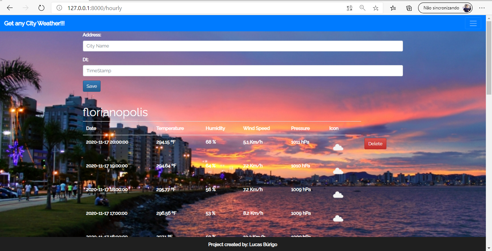
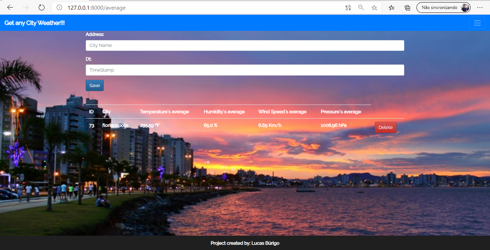
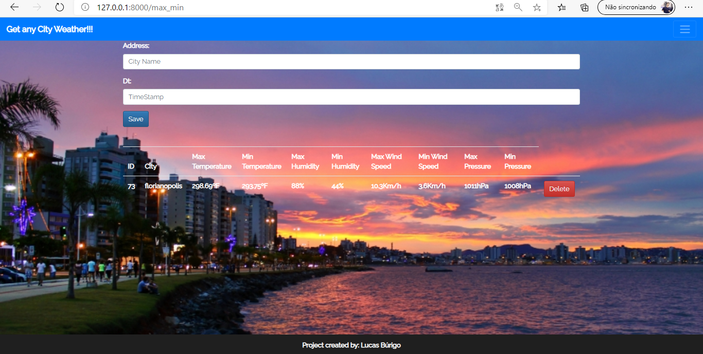
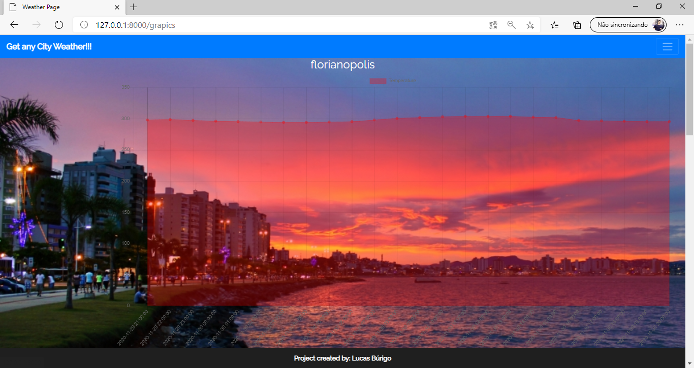
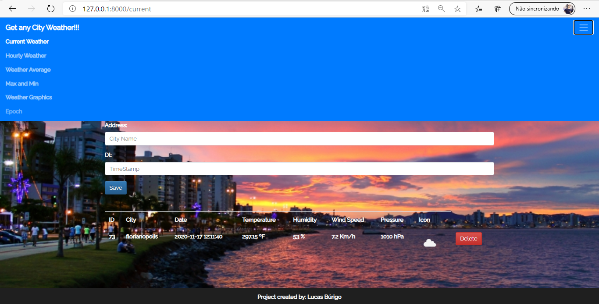
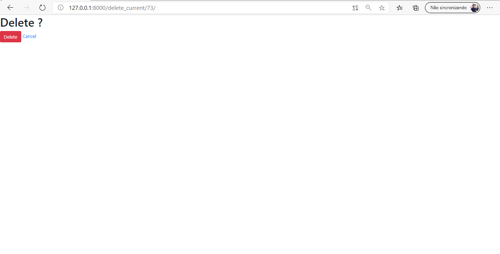

# Django_Small_Weather_Project
### This project consumes a Weather API from the website [RapidAPI](https://rapidapi.com/community/api/open-weather-map) to return the datas that are used in the existing functionaties in the project.

So, to describe this project, I will divide my explanation into 2 parts.\
     1. Show all the functionalities (The project itself) \
     2. Show all the programs and the packages that you will need to have for build this project
     

1) Functionalities

     * **Main page** \
          :bookmark: In this template, we can see an effect in the header, the parallax effect and a fix footer. \
          
           \
          :exclamation: When you click in the hiperlink, where the mouse go over (Hourly Weather), you will be directed to the corresponding page. 
          
     
     * **Current Weather page** \
          :bookmark: Here you see a form, when you can write an existing city, and the server wiil return a table with the current weather features of the choosen city.
          
           
          

     * **Hourly Weather page** \
          :bookmark: Here you also can see a form (all the pages, except the main page and the graphics page, have a from). In this page, you will get as answer of the server, the data of the weather features each hour, started  24 hours ago until the current time.
          
           
          
     
     * **Average Weather page** \
          :bookmark: Here you will get the average of the those 4 current weather features.
          
           
          
     * **Max and Min Weather page** \
          :bookmark: Is this page, you can get the maximum and the minimum values of the weather features.
          
           
     
     
     * **Graphics page** \
          :bookmark: This page have one problem that i´m trying to fix. However, keep patient because this functionality will come to help the view of those features.
          
          
          
     * **Nav bar** \
          :bookmark: You can go to any of those pages clicking in the burger menu on the top left corner and choose one of then (current, hourly, average, max_min, graphics).
          
           
          
          
     * **Delete page** \
          :bookmark: You can also delete a choosen city, by clicking in the red delete bottom. it will direct you to the delete page of this specific city.
          If you delete this city or if you choose to cancel, both the bottons will direct you to the last page you were on.
          
           
          
          
          
2) What you need to download?

     |    Django 3.0.3   | Geopy |  Datetime |
     | ------------- | ------------- |----------|
     | [pip install Django](https://www.djangoproject.com/download/)| [pip install Geopy](https://pypi.org/project/geopy/)|[pip install Datetime](https://pypi.org/project/datetime2/)|

         
          
        
        
